# support-matrix 前端部署

测试矩阵前端网站采用 Astro 框架，可以部署在 Cloudflare Worker Pages 上。

开源仓库位于：https://github.com/QA-Team-lo/support-matrix-frontend

support-matrix 主仓库使用 Git submodule 的形式链接到了前端仓库内，目前采用 GitHub Actions CI 进行自动同步。

## Prerequisites

- 一个可用的 Cloudflare 账户
    - Free Plan 就足够了
- GitHub token
    - 用于自动同步 submodule
- （可选）一个可用的域名
    - Cloudflare 免费提供的 workers.dev 域名在中国大陆地区不可访问，需要绑定自己的域名方可使用

## Deployment

登录 [Cloudflare Dashboard](https://dash.cloudflare.com/)。

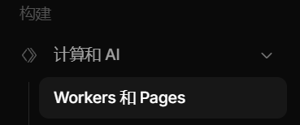

点击右上角 `创建应用程序`。

点击下方小字 `Get started`。

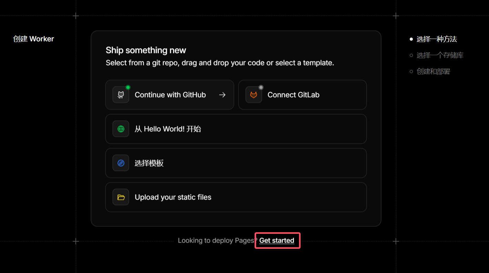

选择 `导入现有 Git 存储库`。

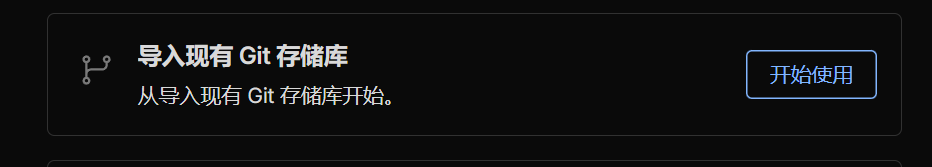

若之前没有绑定过 GitHub 账户，需要先授权 Cloudflare 访问 GitHub。

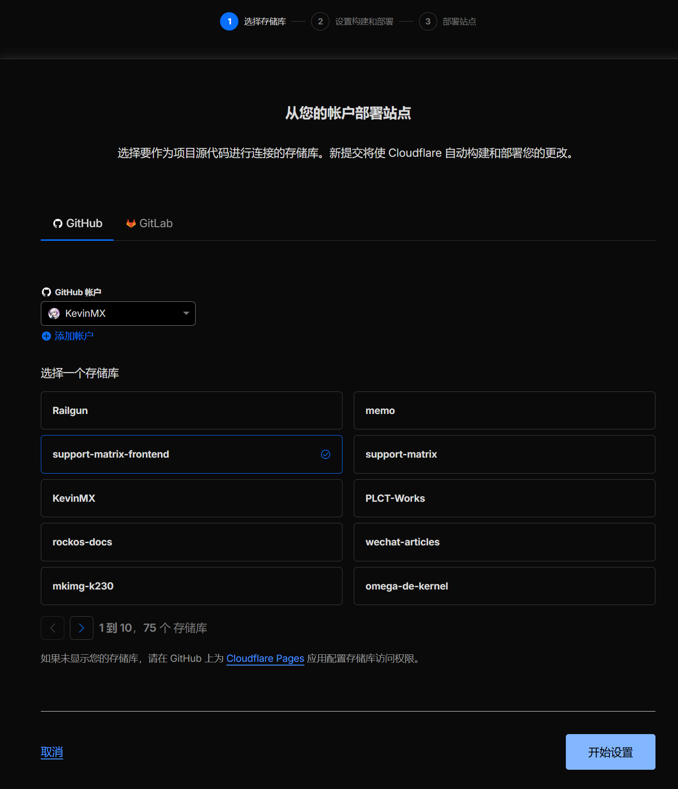

选好仓库之后，点击开始设置。

框架预设选择 `Astro`，Cloudflare 会自动设置部署命令和目录，保持默认即可。

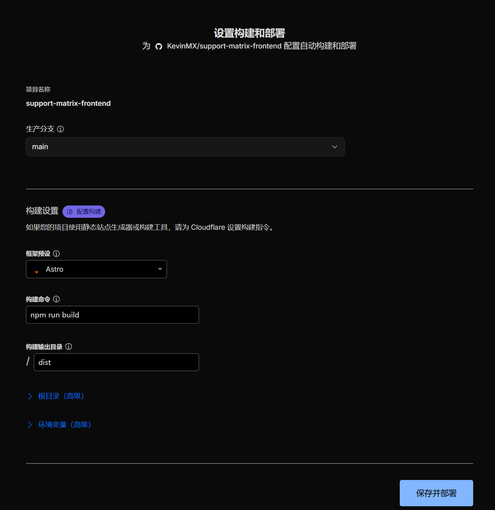

点击`保存并部署`，等待部署完成。

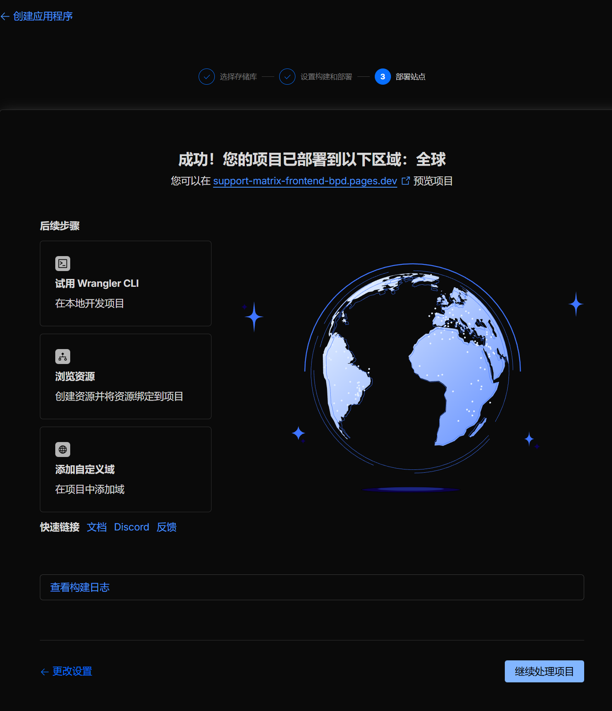

## 设置自定义域名

初次部署完成后，若网络条件允许，应当可以直接通过Cloudflare 自动生成的 pages.dev 域名访问。

如需绑定自定义域名，在刚刚部署完成后，点击`添加自定义域`-`设置自定义域`-输入域名（例如 `example.ruyisdk.org`）

输入好后，点击`开始 CNAME 设置`。

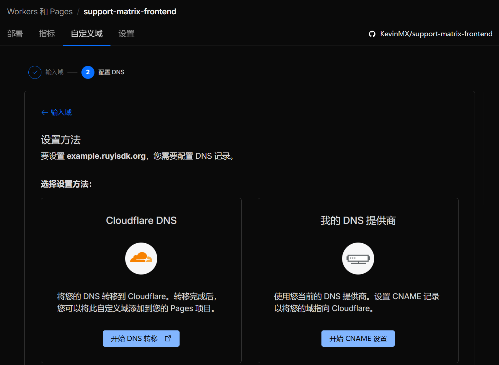

请找对应域名所有者添加页面上提示的 CNAME 记录。下图仅供参考。

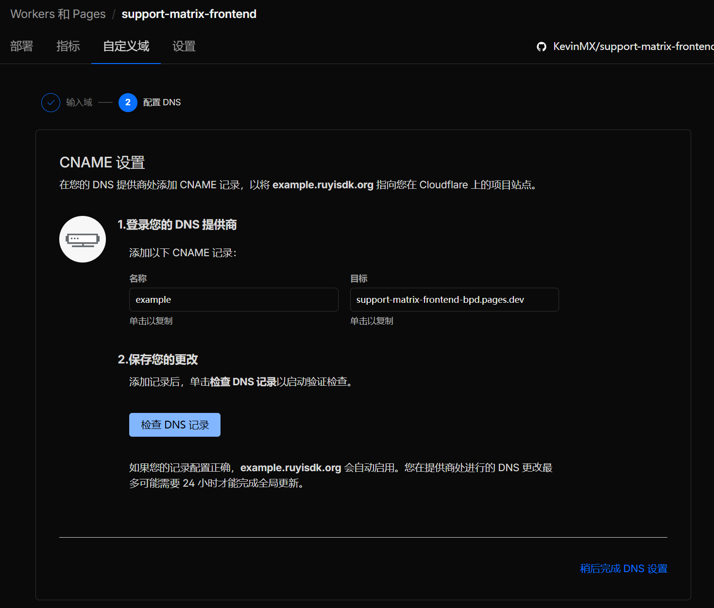

设置好后，点击检查 DNS 记录。可能需要最多 24 小时才能生效。

## submodule 自动更新

登录 GitHub。

点击右上角头像 -> Settings

点击 `Developer Settings` -> `Personal access tokens` -> `Tokens (classic)`

点击右上角 `Generate new token` -> `Generate new token (classic)`

参考下图设置。

名称：`MATRIX_TOKEN`

有效期：（任选）

Token 生效域 / scope：勾选 `repo` 和 `workflow`

其它选项保持默认。

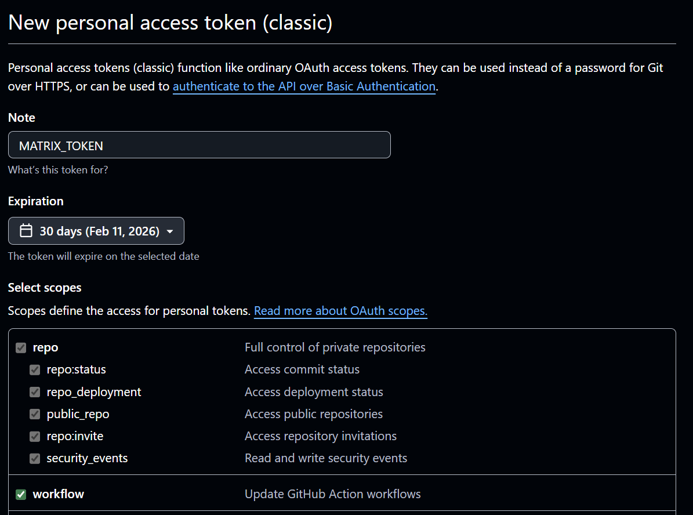

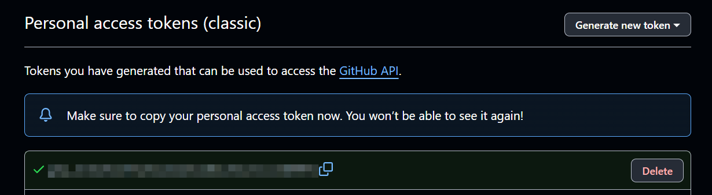

点击复制 token。

> [!WARNING]
> 出于安全考虑，Token 只会显示这一次，这是唯一的复制机会。
> 以后如果需要重新复制，只能重新生成。

回到 `support-matrix-frontend` 仓库，点击 `Settings` -> `Secrets and variables` -> `Actions`

点击 `New repository secret`。

Name: MATRIX_TOKEN

Secret: 填写刚才复制的 Token 内容

点击 `Add secret`。

此时可以回到 `Actions` 选项卡，开启仓库的 `Nightly Submodule Update` 了。

Fork 仓库默认需要手动启用 Workflow，以免意外。

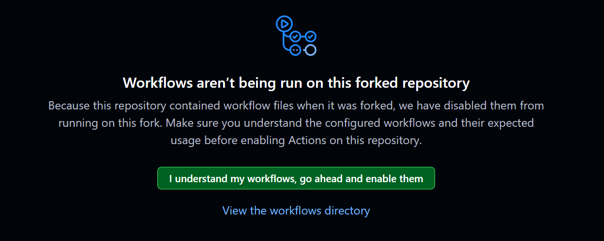

GitHub 的 `actions-user` 会使用你刚才创建的 token 权限，每日定时拉取 support-matrix 主仓库更新。